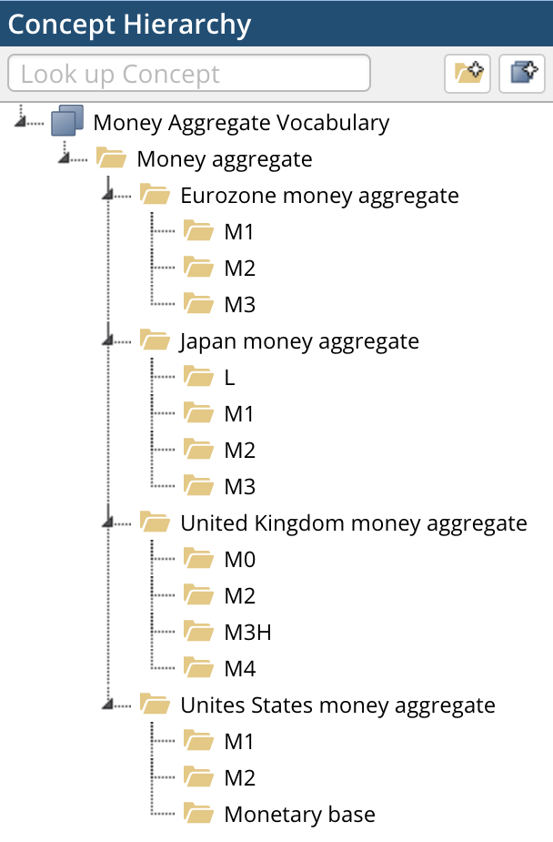
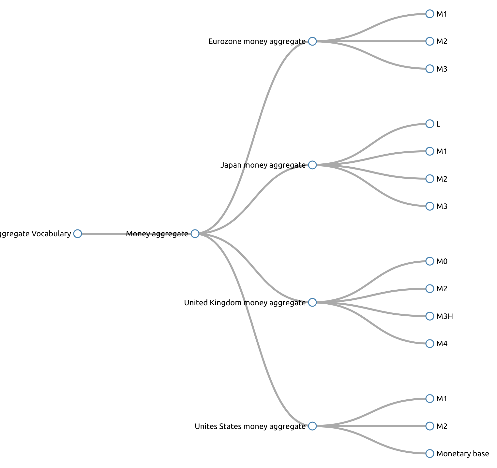

# Money Aggregate Vocabulary

## Introduction

Money Aggregate Vocabulary, or MoneyAggVoc for short, is an attempt to catalogue 
money aggregate measures listed in the Exhibit 3 Definitions of Money in 
Reading 19 on Economics of the CFA Program Curriculum 2016 Level I (ISBN 978-1-942471-19-6) 
with some minor additions. 

Although the [CFA Program Curriculum](https://www.cfainstitute.org/) inspired the structure of the concepts in this vocabulary, 
the actual content was taken from open sources (DBpedia, Federal Reserve System, 
European Central Bank, Bank of Japan and Bank of England) and includes appropriate references.

Simple Knowledge Management System (SKOS) is used to express the vocabulary.

Preferred prefix when using the vocabulary is `mav`.

```turtle
@prefix mav: <http://cadmiumkitty.github.io/moneyaggvoc/> .
@prefix skos: <http://www.w3.org/2004/02/skos/core#> .
@prefix dcterms: <http://purl.org/dc/terms/> .
```

## Interesting questions

Is "Money aggregate in the Eurozone" (http://cadmiumkitty.github.io/moneyaggvoc/#mav003) a `skos:Concept` or `skos:Collection`? 
I'd say it is a `skos:Concept`, since there is a corresponding EuroVoc concept (http://eurovoc.europa.eu/1825).

Is European Central Bank (EBC) Broad Money (M3) a broader concept than Narrow Money (M1)?
I'd say no, they are all just measures of money supply. It would make sense to order them, but not create a hierarchy.

Is Narrow Money and Broad Money alternative labels or another level of concepts?
I'd say they are alternative labels where definitions call them out in that way (for example ECB definitions of M1, M2 and M3), 
even though in some cases narrow money sounds like a concept that includes multiple measures (for example Bank of England M0 and M2).

Shall I be using `dcterms:title` and `dcterms:description` or `rdfs:label` and `rdfs:comment` for the Scheme?
I went with `rdfs:label` and `rdfs:comment` to allow TopBraid and SKOS Play to work out of the box in a nice way, even though 
[SKOS Primer](https://www.w3.org/TR/skos-primer/) suggests the use of `dcterms:title` and `dcterms:description`.

Would calling it "moneyvoc" be too ambitious?
Yes, it would be, in the end I'm only trying to describe the money supply concepts. MoneyAggVoc it is.

## Prerequisites

You need Docker (https://docs.docker.com/) and Docker Compose (https://docs.docker.com/compose/) 
installed as a starting point. The rest of the build is done in the docker containers. All other dependencies are pulled by Anaconda Project, RubyGems and Docker.

## Generating Money Aggregate Vocabulary

```shell
docker-compose up -b
```

Log into Notebook (http://localhost:8888) and run `moneyaggvoc.ipynb`.

## Other considerations and potential next steps

 * I really ought to rewrite my [rdfpandas](https://github.com/cadmiumkitty/rdfpandas) package as a Conda package.
 * There is an issue open for RdfLib calling for an [easy way to expand CURIE with NamespaceManager](https://github.com/RDFLib/rdflib/issues/626).
 * Add Ordered Turtle Serializer from (https://github.com/scriptotek/otsrdflib)

## Rendering static site

[MoneyAggVoc](https://cadmiumkitty.github.io/moneyaggvoc/) static website is rendered using [jekyll-rdf](https://github.com/white-gecko/jekyll-rdf). 

## Visualization

There are multiple visualization tools available for SKOS.

[TopBraid EDG](https://www.topquadrant.com/products/topbraid-enterprise-data-governance/) visualization would look like this.



[SKOS Play!](http://labs.sparna.fr/skos-play/) visualization would look like this.

